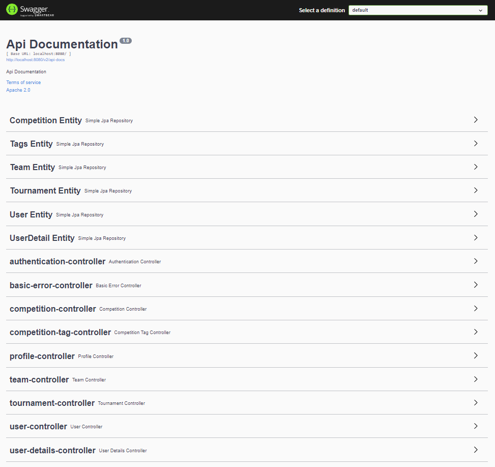

# Create competitions

_ _ _

Application for organizing amateur informal and official sports events with tables, results, tree of matches, etc.

- - -

Project is created with:

* Java 11
* Spring Boot 2.3.1
* Spring Security v.5.3.5
* Spring Data JPA v.2.3.1
* Hibernate v.5.4.22
* MySQL v.8.0.21
* Flyway v.6.5.7
* RabbitMQ v.3.8.12
* Maven v.3.6.3
* Lombok v.1.18.12.
* Junit v.5.6.2
* Mockito v.3.3.3
* Thymeleaf v.3.0.11
* Swagger2 v.3.0.0

### How to build container with RabbitMq Service and MySQL database:
1. Go to folder named docker
2. Type command: docker-compose up -d

### Features

_ _ _

1. Create events and competitions with all details.
2. Tables with results.
3. Team draws.
4. Create a tree of matches with or without groups, depending on the number of teams.
5. Create team, invite people and join competition or event.
6. After each match, the organizer marks who won and who lost + team members do the same (avoid trying to cheat). the decision is made, as from each team at least 50% will give the same decision as the organizer otherwise, when one of the teams does not agree, the match is repeated or its result is finally approved by the organizer.
7. Possibility to write a public opinion about the organizer
8. Most of data are public, so beginner athletes can boast about how they did before

_ _ _
API Docummencation: 
http://localhost:8080/swagger-ui/index.html

###### Status

_ _ _

Project is in progress with some active features and other improvements to make.
